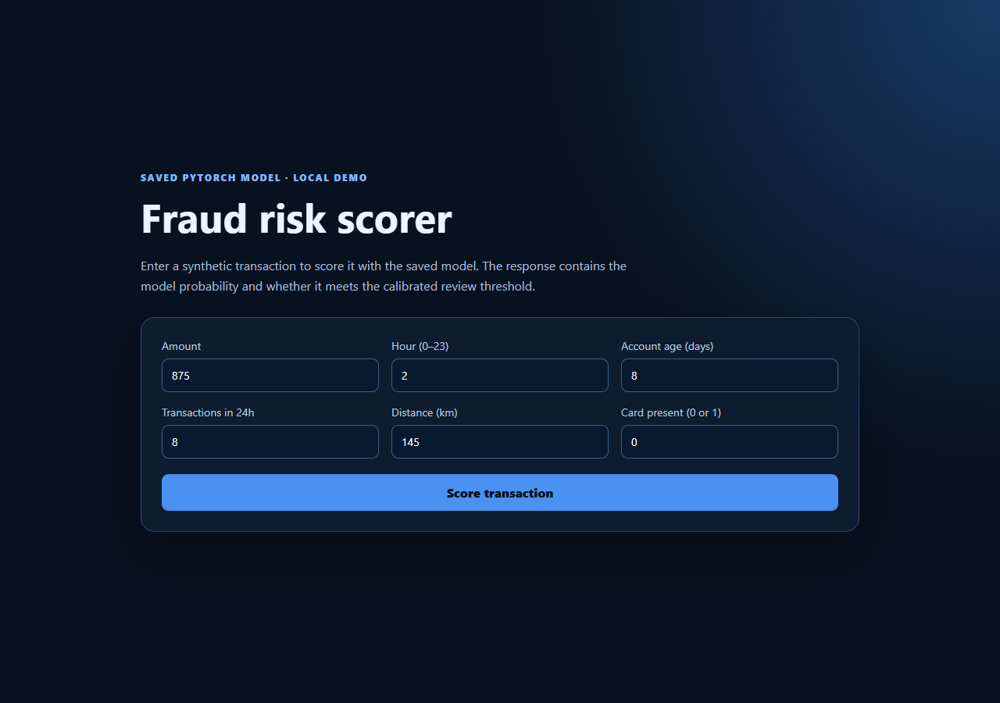
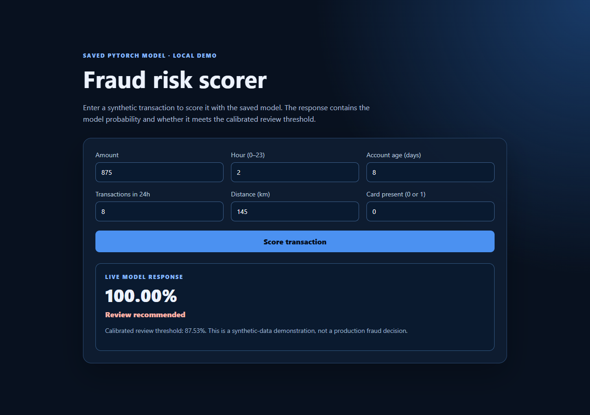

# Banking Fraud Detection — ML Methodology Project

## Overview

Methodology-focused project applying **PyTorch** to imbalanced tabular fraud classification. Its core contribution is the disciplined separation of model fitting, validation-only threshold calibration, and held-out evaluation under a precision floor. It intentionally does not make a dashboard or bank-integration product claim.

**Current reference run:** 100 epochs with a 0.80 validation precision floor produced **76.74% held-out precision** and **77.95% held-out recall** on the synthetic test split. The default `models/fraud_mlp.pt` and `models/fraud_mlp.metrics.json` are this run.

## Live scorer

The saved model is served through a small FastAPI endpoint with a real form—no fabricated statistics; every displayed number comes from `models/fraud_mlp.pt`.

**Hosted demo:** [banking-ai-automatic-fraud-detection.onrender.com](https://banking-ai-automatic-fraud-detection.onrender.com/). Render's free instance may show a brief cold-start screen before the application responds.

| Form | Result |
|---|---|
|  |  |

Run it yourself: `python -m uvicorn src.api:app --reload`, then open `http://127.0.0.1:8000`.

## Architecture

```text
transactions.csv (numeric features + is_fraud)
                    |
                    v
             src/data.py
    validates labels and numeric features
                    |
                    v
       stratified 70 / 15 / 15 split
       train      validation      test
         |             |            |
         v             v            v
 StandardScaler +  choose review    held-out metrics
 PyTorch FraudMLP threshold only    (not used to tune)
 weighted BCE loss on validation
         \             /             |
          v           v              v
       models/fraud_mlp.pt + fraud_mlp.metrics.json
                    |
                    v
      src/predict.py -> probability + review flag CSV

```

The browser form submits the six feature values to `POST /score`. `src/api.py` loads the saved artifact through the shared scoring logic in `src/predict.py`, standardizes feature values with the saved scaler, and returns the real probability, threshold, and review flag.

### Model

```text
numeric vector -> Linear(input,64) -> ReLU -> Dropout(0.20)
               -> Linear(64,32)    -> ReLU -> Dropout(0.10)
               -> Linear(32,1)     -> logit -> sigmoid probability
```

`BCEWithLogitsLoss` uses a training-derived positive-class weight because fraud is rare. The threshold is then selected from validation predictions to maximize recall while meeting a precision floor. This separates model fitting, policy calibration, and final testing.

## Components

| Path | Purpose |
|---|---|
| `src/data.py` | Data contract and synthetic smoke-test data |
| `src/model.py` | PyTorch MLP classifier |
| `src/train.py` | Split, standardize, train, calibrate, evaluate, save artifact |
| `src/predict.py` | Batch scoring with saved feature order, scaler, and threshold |
| `src/api.py` | Local FastAPI endpoint and dashboard host for one-transaction scoring |
| `dashboard/` | Small form that displays the saved model's real score and review decision |

## Data contract

The CSV requires binary `is_fraud` and one or more numeric columns:

```csv
amount,hour,account_age_days,transactions_24h,distance_km,card_present,is_fraud
149.20,23,410,1,8.2,1,0
879.00,2,5,8,145.5,0,1
```

Missing values are rejected to keep preprocessing explicit. A real system would additionally define categorical encoding, time-based validation, feature ownership, data retention, privacy controls, and schema versioning.

### Data provenance

`data/transactions.csv` is a checked-in **synthetic** sample generated by `make_demo_data()` for reproducible scoring demonstrations. It is not approved bank data, does not contain customer transactions, and must not be described as real transaction data. The `--data` command path supports an approved external CSV that meets the documented contract, but this repository does not include such a dataset.

## Why these metrics

Accuracy can be misleading when fraud is rare: predicting every transaction as legitimate may look accurate yet catch no fraud. This project reports **average precision** for ranking quality and **precision / recall** at the chosen threshold. The precision floor represents manual-review capacity. The test set is never used to choose that threshold.

Do not quote synthetic-data metrics as real-world results. Save the generated metrics JSON and state the dataset, split, and metric for every number used in an interview.

## Reproducible operating-point sweep

The following synthetic-data runs used seed `7`, 30 epochs, and a fixed 70 / 15 / 15 split. Thresholds are selected on validation data only; precision and recall below are one-time held-out test measurements. They are not real-world fraud performance claims.

| Requested validation precision floor | Average precision | Test precision | Test recall | Selected threshold |
|---:|---:|---:|---:|---:|
| 0.20 | 0.7256 | 0.1943 | 0.9685 | 0.0523 |
| 0.40 | 0.7256 | 0.3746 | 0.9528 | 0.2482 |
| 0.50 | 0.7256 | 0.4724 | 0.9449 | 0.4086 |
| 0.60 | 0.7256 | 0.5800 | 0.9134 | 0.5733 |
| 0.75 | 0.7256 | 0.7526 | 0.5748 | 0.9072 |
| 0.80 | 0.7256 | 0.7903 | 0.3858 | 0.9570 |

This makes the policy tradeoff explicit: a stricter review threshold improves precision but sends more fraud through unflagged. A validation precision floor is a calibration target, not a guarantee that the held-out test precision will exactly meet it; the 0.60 row illustrates normal split-to-split variation.

### Training-duration experiment

Using the same seed and split, 100 epochs improved ranking quality and high-floor recall relative to the 30-epoch runs:

| Validation precision floor | Epochs | Average precision | Test precision | Test recall |
|---:|---:|---:|---:|---:|
| 0.75 | 30 | 0.7256 | 0.7526 | 0.5748 |
| 0.75 | 100 | 0.7552 | 0.7466 | 0.8583 |
| 0.80 | 30 | 0.7256 | 0.7903 | 0.3858 |
| 0.80 | 100 | 0.7552 | 0.7674 | 0.7795 |

The 100-epoch runs therefore gained 0.2835 recall at the 0.75 operating point and 0.3937 recall at the 0.80 operating point. The 0.80 test precision remains below its requested validation floor, reinforcing that calibration constraints must be checked on held-out data.

### Resume-ready wording

- Trained a PyTorch fraud-classification model on highly imbalanced synthetic transaction data, calibrating thresholds via validation-only selection to reach **76.7% precision** and **78.0% recall** on a held-out synthetic test set—avoiding the accuracy trap common in rare-event classification.

The held-out test set contains 1,200 rows with a 10.58% fraud rate. The base 0.20 run saved `models/fraud_mlp.pt` and [`models/fraud_mlp.metrics.json`](models/fraud_mlp.metrics.json); every sweep point has a matching `models/fraud_mlp_<floor>.pt` and JSON. A generated synthetic input file, `data/transactions.csv`, was then scored successfully with `src.predict`, producing `predictions.csv` for 8,000 rows.

### Generator-aware oracle reference

Before fitting the MLP, `python -m scripts.benchmark_oracle` ranks the same held-out examples by the latent probability used by the synthetic generator. This is an empirical Bayes-optimal reference for this exact generator and sampled split—not a real-world ceiling. It obtains test average precision **0.8248**, compared with the MLP's **0.7256**. At the 0.75 validation-floor operating point, the oracle's held-out result is **0.7229 precision / 0.9449 recall**; the MLP result is **0.7526 / 0.5748**. The gap shows that the MLP has not exhausted the generator's available signal.

### Synthetic-data design and limitation

The demo labels now use non-linear, observable risk patterns: overnight transaction bursts on relatively young accounts, and remote high-value card-not-present purchases. Those combinations receive an intentionally high synthetic fraud probability; background risk remains probabilistic. The model receives only the original six fields, so it must learn those relationships rather than read an oracle indicator. This makes the data more useful for exercising non-linear model behavior, but it remains a synthetic, stationary setup. Real datasets have richer feature interactions, label delay, temporal drift, and operational constraints; they require time-aware validation and comparison with simpler tabular baselines.

## Run the model

```powershell
python -m venv .venv
.venv\Scripts\Activate.ps1
pip install -r requirements.txt

# Entire pipeline with synthetic data only
python -m src.train --demo --epochs 30

# Inspect the generator-aware oracle reference before training
python -m scripts.benchmark_oracle

# Reproduce the operating-point sweep on Windows PowerShell
.\scripts\sweep_precision_floors.ps1

# Genuine approved data
python -m src.train --data data/transactions.csv --minimum-precision 0.20
python -m src.predict --input data/new_transactions.csv --output predictions.csv
```

The model artifact stores weights, standardization values, feature names, and threshold; `predictions.csv` includes `fraud_probability` and `review_recommended`.

## Tests

```powershell
python -m unittest discover -s tests -v
```

The tests cover missing-value rejection, binary-label and numeric-feature contract enforcement, and the MLP forward-pass output shape.

## Run the live scorer dashboard

Train the model first, then start the local service:

```powershell
python -m uvicorn src.api:app --host 127.0.0.1 --port 8000
```

Open `http://127.0.0.1:8000`. The dashboard sends the six form values to `POST /score`, which loads `models/fraud_mlp.pt` through the same scoring logic as `src.predict.py`. It returns only a real `fraud_probability`, calibrated review decision, and threshold—there are no fabricated operational statistics.

## Operational limits and next steps

- Synthetic data proves reproducibility, not fraud-detection validity.
- Use time-based splits to prevent future leakage in real transaction data.
- Compare this MLP with logistic regression and gradient-boosted trees.
- Set the operating threshold with fraud analysts using review capacity and false-positive cost.
- Add drift monitoring, audit logs, access control, model versioning, fairness review, and human feedback before deployment.
- Never commit customer data, secrets, or sensitive trained artifacts.

## Interview walkthrough

“I built a reproducible PyTorch fraud-methodology workflow. Since fraud is imbalanced, I used a class-weighted loss and reported average precision plus precision and recall—not accuracy. I used stratified train, validation, and test splits; selected the review threshold only on validation data; and evaluated once on held-out test data. The saved artifact carries the scaler, feature order, and threshold into batch inference. A production version would need time-based validation, governance, monitoring, and input from fraud operations.”

Key technical questions: why accuracy fails under imbalance; why test data must not choose the threshold; when a tree model might win; and which transaction fields could leak future information.
